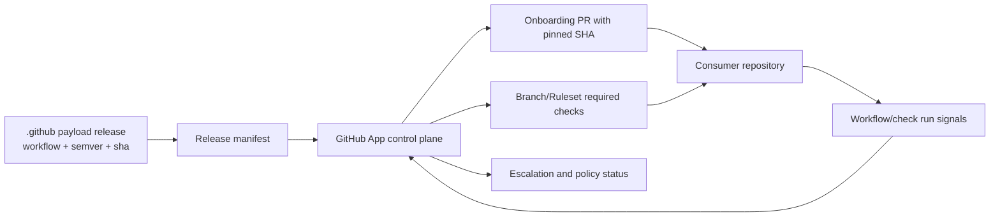

# ADR: GitHub App Control Plane vs `.github` Payload Boundary

**Status:** Accepted  
**Date:** 2026-06-26  
**Owners:** Platform Architecture (Lane C), `.github` Maintainers, GitHub App Maintainers

## Context

AgentCraftworks operates across two repos/scopes:

1. **GitHub App (control plane):** Runtime orchestration, policy evaluation, onboarding automation, and escalation.
2. **`AgentCraftworks/.github` (payload plane):** Versioned reusable workflows, templates, and standards consumed by product repos.

To prevent coupling and enable safe rollout, policy intent and policy payload must have an explicit contract.

## Decision

We formalize a strict boundary:

- The **GitHub App is authoritative for evaluation and enforcement decisions**.
- The **`.github` repo is authoritative for versioned workflow/policy payload artifacts**.
- Integration between them uses immutable release metadata (SemVer + pinned commit SHA) and stable policy signals.

## Responsibilities

| Area | GitHub App (Control Plane) | `.github` Repo (Payload Plane) |
| --- | --- | --- |
| Policy decisions | Evaluates pass/fail/escalate using policy rules and environment caps | Declares reusable workflow behavior and required inputs/outputs |
| Runtime actions | Posts status/check summaries, labels, escalation issues/comments, onboarding PRs | Executes reusable workflows/templates in consumer repos |
| Release consumption | Resolves approved payload release (`workflow_id`, `version`, `sha`) | Publishes release manifest and SemVer governance |
| Auditability | Stores decision rationale and correlation IDs | Stores immutable workflow source and release manifest |
| Backward compatibility | Enforces contract compatibility and rollout gates | Maintains versioned contracts; breaking changes require major bump |

## Interface Contract (Control ↔ Payload)

The control plane consumes payload releases via:

- `workflow_id` (stable logical name)
- `version` (SemVer)
- `sha` (immutable commit SHA)
- `required_checks` (canonical check names to enforce)
- `escalation_signals` (named outcomes from workflow/run state)

Required invariants:

1. All required consumer paths pin reusable workflow references to immutable SHA.
2. Every consumable payload release must exist in `docs/standards/reusable-workflow-releases.md`.
3. Control-plane enforcement must reject mutable refs (`@main`, tags without resolved SHA) for required checks.
4. Breaking payload changes require major version and explicit onboarding/migration notes.

## Release Artifact Contract

For each releasable reusable workflow, payload plane must publish:

- `workflow_id`
- `semver`
- `commit_sha`
- `published_at`
- `contract_version` (optional until first incompatible contract change)
- `migration_notes` (required for major version)

This contract is satisfied by the release manifest plus workflow file at the pinned SHA.

## Onboarding Inputs and Outputs

### Inputs (to control plane)

- Target repository
- Branch/ruleset scope (`staging`, `main`, or approved equivalent)
- Selected payload release (`workflow_id`, `version`, `sha`)
- Required checks policy (blocking vs informational)

### Outputs (from control plane)

- Onboarding PR(s) with pinned SHA workflow references
- Ruleset/branch-protection required check mapping
- Adoption status (`proposed`, `active`, `drifted`, `escalated`)
- Escalation record when policy violations occur

## Enforcement Signals (for Lanes D/E)

Control-plane evaluation must emit and consume stable signals:

- `sha_pinned`: required workflow uses immutable SHA
- `required_checks_configured`: branch/ruleset contains required check set
- `required_checks_passing`: required checks pass for protected branches/PRs
- `release_manifest_resolved`: pinned SHA maps to published release entry
- `policy_drift_detected`: workflow ref/check config diverges from policy
- `escalation_required`: violation exceeded auto-remediation policy

Lane D should implement onboarding and drift detection against these signals.  
Lane E should implement blocking/escalation policy using these signals.

## Ownership Model

- **GitHub App team:** Control-plane logic, decision engine, escalations, onboarding automation.
- **`.github` maintainers:** Workflow payload definitions, release manifest, SemVer governance.
- **Joint approval required:** Any interface/contract change that affects `required_checks`, signal names, or release metadata shape.

## Non-goals

- Defining business-specific branch naming conventions beyond policy inputs.
- Replacing repository-level CODEOWNERS ownership decisions.
- Defining all possible escalation destinations (only required signal contract is standardized here).
- Allowing mutable refs for required production/staging policy paths.

## Dependency Diagram

